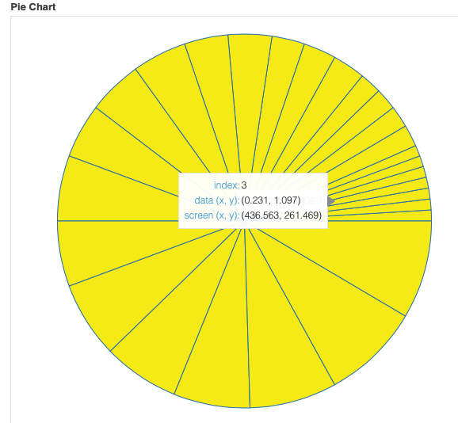

# Data Visualization

As this part of the lab, you need to pick one these data viz packages, and then

- show some snazzy examples of what a DE can do with this package
  - this can be examples from tutorials or other examples
  - they need to be "wow" - you may want to find a "Gallery" of cool examples
- show how you would "drive" this package with a language, preferably Python (or another DE language, perhaps the language you chose for the language portion of this lab.)
  - write 3 or 4 sample programs that use the language to create a visualization from some simple, understandable data
- write a jupyter notebook (in python or other language) which acts as a "walk-thru" teaching someone how do the fundamentals of your chosen package

You choices are:

- Bokeh 
- ggplot or ggplot2
- matplotlib
- Plotly
- Seaborn

(all of these really cool) 
***Bokeh*** 
__Bokeh__ is an interactive visualization library that targets modern web browsers for presentation. Bokeh is a tool in the Charting Libraries category of a tech stack. It is good for: 
- Interactive visualization 
- Standalone HTML documents, or server-backed apps 
- Expressive and versatile graphics 
- Large, dynamic or streaming data 
- Easy usage from python (or Scala, or R, or...)

Curently has two main interfaces: 
  - bokeh.models -A low-level interface that provides the most flexibility to application develpers. 
  - bokeh.ploting - A higher-lever interface centered around composing visual glyphs. 
  for instalation -> python package index at python.org and see __installation__ instructions for bokeh. 
Alternative to Bokeh: 
   - Plotly 
   - Matplotlib 
   - Tableau etc 
According to the StackShare community, Matplotlib has a broader approval, being mentioned in 10 company stacks & 19  developers stacks; compared to Bokeh, which is listed in 4 company stacks and 7 developer stacks. 
- __Matplotlib__ is based on the plotting capabilities of MATLAB, the scientific programming, analysis and plotting environment  and programming language. It __does not__ provide a way to generate interactive plots that can be viewed in the web browser. 
when it comes to Tableau, it's like comparing apple and oranges: 
- __Tableau__ can help anyone see and understand their data. Connect to almost any database, drag and drop to  create visualizations, and share with a click.  
    - from personal experince i would say troubleshooting is hard when integrating with databases, not sure if it was because i was using a free version. But still i couldn't find enough resource.
- __Bokeh__ - goal is to provide elegant, concise construction of __versatile graphics__, and to extend this capability with __high-performance__ interactivity over very large or streaming datasets. It can help anyone who would like to quickly and easily create interactive plots, dashboards, and data applications. 
  - It's not easy to learn each new function and takes time.
  - provides the most important types of graph and they are all provided in line with the modern HTML 5 web standard, which has speed advantage. But, some browser do not support the HTML5 standard.
As of photograpy -->Bokeh, also known as “Boke” is one of the most popular subjects in photography. The reason why  it is so popular, is because Bokeh makes photographs visually appealing, forcing us to focus our attention  on a particular area of the image.

__to run from the terminal__ 
bokeh serve --show filename.ipynb command

__ColumnDataSource__  is the core of most Bokeh plots, providing the data that is visualized by the glyphs of the  plot. With the ColumnDataSource , it is easy to share data between multiple plots and widgets, such as the DataTable .
due to some issues i was not able to display the plots on the jupyter notebook here(git) so i have posted some examples:

